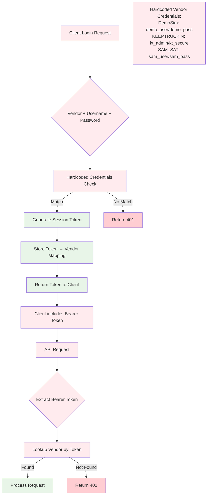

# HOS Demo API Flow Diagram

## Authentication & Data Flow

```mermaid
graph TD
    %% Client Side
    A[React Client] --> B[Login Form]
    B --> C[Select Vendor + Credentials]
    
    %% Authentication Flow
    C --> D[POST /auth/login]
    D --> E[AuthController]
    E --> F{Validate Credentials}
    F -->|Valid| G[Generate Session Token]
    F -->|Invalid| H[Return 401 Unauthorized]
    G --> I[Store in SessionStore]
    I --> J[Return Session Token to Client]
    
    %% Authenticated Requests
    J --> K[Client stores token in memory]
    K --> L[Add Bearer token to all requests]
    
    %% Driver HOS Flow
    L --> M[GET /drivers/{id}/hos]
    M --> N[DriversController]
    N --> O{Validate Session}
    O -->|Invalid| P[Return 401]
    O -->|Valid| Q[Query HosRepository]
    Q --> R[Return Driver HOS Data]
    
    %% ELD Events Flow
    L --> S[POST /eld/events]
    S --> T[EldController]
    T --> U{Validate Session}
    U -->|Invalid| V[Return 401]
    U -->|Valid| W[Set VendorId from Session]
    W --> X[EldNormalizer.Normalize]
    X --> Y[HosRepository.SaveAsync]
    Y --> Z[Return 202 Accepted]
    
    %% Data Layer
    Q --> DB[(PostgreSQL Database)]
    Y --> DB
    
    %% Session Management
    I --> SS[SessionStore<br/>In-Memory Dictionary]
    O --> SS
    U --> SS
    
    %% Styling
    classDef client fill:#e1f5fe
    classDef auth fill:#f3e5f5
    classDef api fill:#e8f5e8
    classDef data fill:#fff3e0
    
    class A,B,C,K,L client
    class D,E,F,G,H,I,J,SS auth
    class M,N,O,P,Q,R,S,T,U,V,W,X,Y,Z api
    class DB data
```

## API Endpoints Overview

```mermaid
graph LR
    %% Authentication
    A[Client] -->|POST| B[/auth/login]
    A -->|POST| C[/auth/logout]
    
    %% Protected Endpoints
    A -->|GET + Bearer Token| D[/drivers/{id}/hos]
    A -->|POST + Bearer Token| E[/eld/events]
    
    %% Controllers
    B --> F[AuthController]
    C --> F
    D --> G[DriversController]
    E --> H[EldController]
    
    %% Services
    G --> I[HosRepository]
    H --> J[EldNormalizer]
    H --> I
    
    %% Data
    I --> K[(Database)]
    
    classDef endpoint fill:#bbdefb
    classDef controller fill:#c8e6c9
    classDef service fill:#ffe0b2
    classDef data fill:#ffcdd2
    
    class B,C,D,E endpoint
    class F,G,H controller
    class I,J service
    class K data
```

## Data Models Flow

```mermaid
graph TD
    %% Input Models
    A[VendorLoginRequest] --> B[AuthController]
    C[EldEventBatch] --> D[EldController]
    
    %% Processing
    B --> E[Session Token]
    D --> F[EldNormalizer]
    F --> G[UpdateDriverHos[]]
    G --> H[DriverHosSnapshot[]]
    
    %% Output Models
    I[DriversController] --> J[DriverHosSnapshot]
    
    %% Storage
    H --> K[(Database)]
    K --> J
    
    %% Model Details
    L[EldEventBatch<br/>- VendorId: string<br/>- Events: UpdateDriverHos[]]
    M[UpdateDriverHos<br/>- DriverId: Guid<br/>- AvailableHours: int?<br/>- AvailableDrivingTime: decimal?<br/>- AvailableOnDutyTime: decimal?<br/>- Available6070: decimal?<br/>- DutyStatus: string?<br/>- RecordedAt: DateTimeOffset]
    N[DriverHosSnapshot<br/>- DutyStatus: string?<br/>- AvailableHours: int?<br/>- AvailableDrivingTime: decimal?<br/>- AvailableOnDutyTime: decimal?<br/>- Available6070: decimal?<br/>- RecordedAt: DateTimeOffset]
    
    classDef input fill:#e3f2fd
    classDef process fill:#f1f8e9
    classDef output fill:#fce4ec
    classDef model fill:#fff8e1
    
    class A,C input
    class B,D,F,G,H process
    class E,I,J output
    class L,M,N model
```

## Security Model

