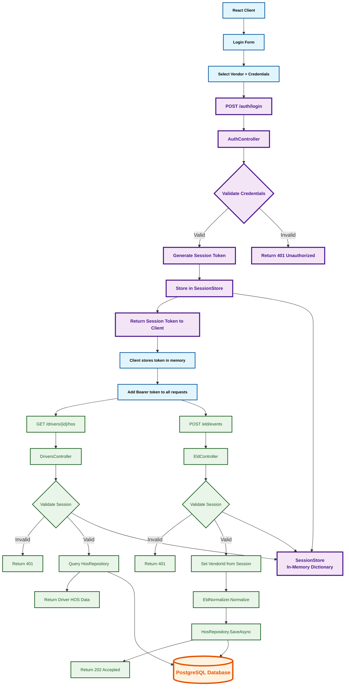
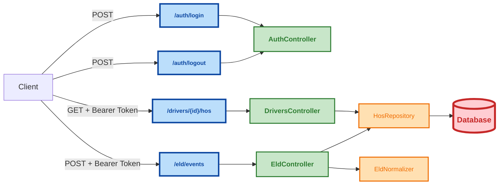
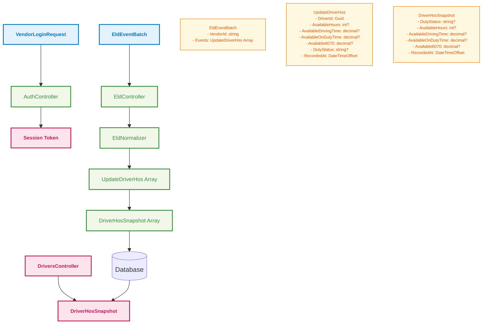
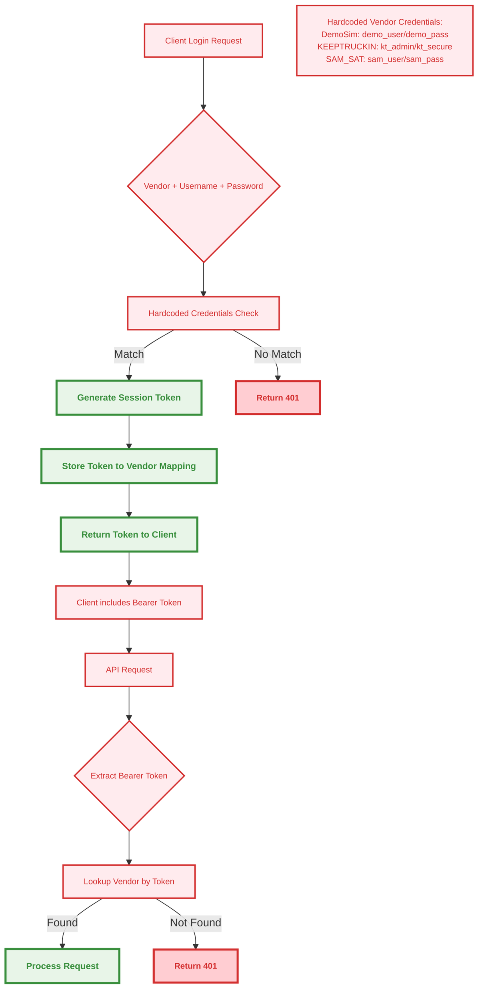

# HOS Demo API Flow Diagram

## Authentication & Data Flow

```mermaid
graph TD
    %% Client Side
    A[React Client] --> B[Login Form]
    B --> C[Select Vendor + Credentials]
    
    %% Authentication Flow
    C --> D[POST /auth/login]
    D --> E[AuthController]
    E --> F{Validate Credentials}
    F -->|Valid| G[Generate Session Token]
    F -->|Invalid| H[Return 401 Unauthorized]
    G --> I[Store in SessionStore]
    I --> J[Return Session Token to Client]
    
    %% Authenticated Requests
    J --> K[Client stores token in memory]
    K --> L[Add Bearer token to all requests]
    
    %% Driver HOS Flow
    L --> M["GET /drivers/{id}/hos"]
    M --> N[DriversController]
    N --> O{Validate Session}
    O -->|Invalid| P[Return 401]
    O -->|Valid| Q[Query HosRepository]
    Q --> R[Return Driver HOS Data]
    
    %% ELD Events Flow
    L --> S["POST /eld/events"]
    S --> T[EldController]
    T --> U{Validate Session}
    U -->|Invalid| V[Return 401]
    U -->|Valid| W[Set VendorId from Session]
    W --> X["EldNormalizer.Normalize"]
    X --> Y["HosRepository.SaveAsync"]
    Y --> Z[Return 202 Accepted]
    
    %% Data Layer
    Q --> DB[(PostgreSQL Database)]
    Y --> DB
    
    %% Session Management
    I --> SS["SessionStore<br/>In-Memory Dictionary"]
    O --> SS
    U --> SS
    
    %% Styling with custom sizes and colors
    classDef client fill:#e1f5fe,stroke:#01579b,stroke-width:2px,color:#000,font-size:12px,font-weight:bold
    classDef auth fill:#f3e5f5,stroke:#4a148c,stroke-width:3px,color:#4a148c,font-size:14px,font-weight:bold
    classDef api fill:#e8f5e8,stroke:#1b5e20,stroke-width:2px,color:#1b5e20,font-size:13px
    classDef data fill:#fff3e0,stroke:#e65100,stroke-width:4px,color:#e65100,font-size:16px,font-weight:bold
    classDef endpoint fill:#bbdefb,stroke:#0d47a1,stroke-width:3px,color:#0d47a1,font-size:11px
    
    class A,B,C,K,L client
    class D,E,F,G,H,I,J,SS auth
    class M,N,O,P,Q,R,S,T,U,V,W,X,Y,Z api
    class DB data
```

## API Endpoints Overview

```mermaid
graph LR
    %% Authentication
    A[Client] -->|POST| B["/auth/login"]
    A -->|POST| C["/auth/logout"]
    
    %% Protected Endpoints
    A -->|"GET + Bearer Token"| D["/drivers/{id}/hos"]
    A -->|"POST + Bearer Token"| E["/eld/events"]
    
    %% Controllers
    B --> F[AuthController]
    C --> F
    D --> G[DriversController]
    E --> H[EldController]
    
    %% Services
    G --> I[HosRepository]
    H --> J[EldNormalizer]
    H --> I
    
    %% Data
    I --> K[(Database)]
    
    classDef endpoint fill:#bbdefb,stroke:#0d47a1,stroke-width:3px,color:#0d47a1,font-size:12px,font-weight:bold
    classDef controller fill:#c8e6c9,stroke:#2e7d32,stroke-width:2px,color:#2e7d32,font-size:14px,font-weight:bold
    classDef service fill:#ffe0b2,stroke:#ef6c00,stroke-width:2px,color:#ef6c00,font-size:13px
    classDef data fill:#ffcdd2,stroke:#c62828,stroke-width:4px,color:#c62828,font-size:16px,font-weight:bold
    
    class B,C,D,E endpoint
    class F,G,H controller
    class I,J service
    class K data
```

## Data Models Flow

```mermaid
graph TD
    %% Input Models
    A[VendorLoginRequest] --> B[AuthController]
    C[EldEventBatch] --> D[EldController]
    
    %% Processing
    B --> E[Session Token]
    D --> F[EldNormalizer]
    F --> G["UpdateDriverHos Array"]
    G --> H["DriverHosSnapshot Array"]
    
    %% Output Models
    I[DriversController] --> J[DriverHosSnapshot]
    
    %% Storage
    H --> K[(Database)]
    K --> J
    
    %% Model Details
    L["EldEventBatch<br/>- VendorId: string<br/>- Events: UpdateDriverHos Array"]
    M["UpdateDriverHos<br/>- DriverId: Guid<br/>- AvailableHours: int?<br/>- AvailableDrivingTime: decimal?<br/>- AvailableOnDutyTime: decimal?<br/>- Available6070: decimal?<br/>- DutyStatus: string?<br/>- RecordedAt: DateTimeOffset"]
    N["DriverHosSnapshot<br/>- DutyStatus: string?<br/>- AvailableHours: int?<br/>- AvailableDrivingTime: decimal?<br/>- AvailableOnDutyTime: decimal?<br/>- Available6070: decimal?<br/>- RecordedAt: DateTimeOffset"]
    
    classDef input fill:#e3f2fd,stroke:#0277bd,stroke-width:2px,color:#0277bd,font-size:12px,font-weight:bold
    classDef process fill:#f1f8e9,stroke:#388e3c,stroke-width:2px,color:#388e3c,font-size:13px
    classDef output fill:#fce4ec,stroke:#c2185b,stroke-width:2px,color:#c2185b,font-size:12px,font-weight:bold
    classDef model fill:#fff8e1,stroke:#f57c00,stroke-width:1px,color:#e65100,font-size:10px
    
    class A,C input
    class B,D,F,G,H process
    class E,I,J output
    class L,M,N model
```

## Security Model

```mermaid
graph TD
    A[Client Login Request] --> B{Vendor + Username + Password}
    B --> C["Hardcoded Credentials Check"]
    C -->|Match| D[Generate Session Token]
    C -->|No Match| E[Return 401]
    
    D --> F["Store Token to Vendor Mapping"]
    F --> G["Return Token to Client"]
    
    G --> H["Client includes Bearer Token"]
    H --> I[API Request]
    I --> J{"Extract Bearer Token"}
    J --> K["Lookup Vendor by Token"]
    K -->|Found| L["Process Request"]
    K -->|Not Found| M[Return 401]
    
    %% Credentials
    N["Hardcoded Vendor Credentials:<br/>DemoSim: demo_user/demo_pass<br/>KEEPTRUCKIN: kt_admin/kt_secure<br/>SAM_SAT: sam_user/sam_pass"]
    
    classDef security fill:#ffebee,stroke:#d32f2f,stroke-width:2px,color:#d32f2f,font-size:12px
    classDef success fill:#e8f5e8,stroke:#388e3c,stroke-width:3px,color:#388e3c,font-size:13px,font-weight:bold
    classDef error fill:#ffcdd2,stroke:#d32f2f,stroke-width:3px,color:#d32f2f,font-size:12px,font-weight:bold
    
    class A,B,C,D,F,G,H,I,J,K,L,N security
    class D,F,G,L success
    class E,M error
```