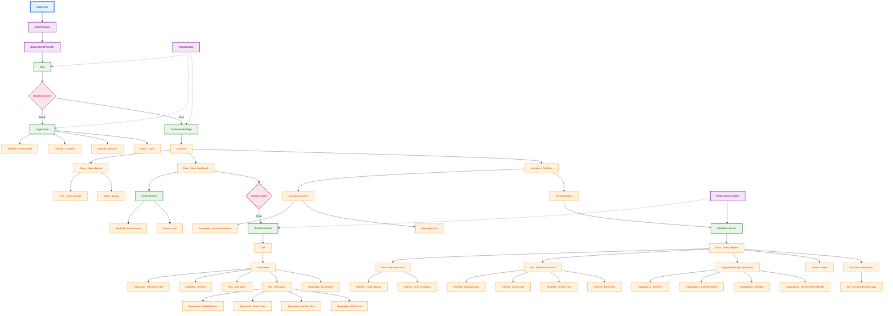
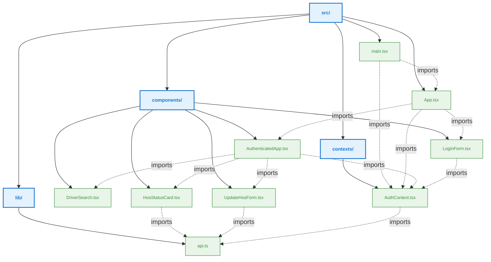

# React Component Tree Diagram

## Component Hierarchy

```mermaid
graph TD
    %% Root Level
    A[main.tsx] --> B[AuthProvider]
    B --> C[QueryClientProvider]
    C --> D[App]
    
    %% App Level
    D --> E{isAuthenticated?}
    E -->|false| F[LoginForm]
    E -->|true| G[AuthenticatedApp]
    
    %% LoginForm Components
    F --> H[TextField - Vendor Select]
    F --> I[TextField - Username]
    F --> J[TextField - Password]
    F --> K[Button - Login]
    
    %% AuthenticatedApp Components
    G --> L[Container]
    L --> M[Paper - Vendor Banner]
    L --> N[Paper - Driver Dashboard]
    L --> O[Accordion - ELD Form]
    
    %% Vendor Banner
    M --> P[Chip - Vendor Display]
    M --> Q[Button - Logout]
    
    %% Driver Dashboard
    N --> R[DriverSearch]
    N --> S{driverId exists?}
    S -->|true| T[HosStatusCard]
    
    %% DriverSearch Components
    R --> U[TextField - Driver ID Input]
    R --> V[Button - Load]
    
    %% HosStatusCard Components
    T --> W[Card]
    W --> X[CardContent]
    X --> Y[Typography - HOS Status Title]
    X --> Z[IconButton - Refresh]
    X --> AA[Chip - Duty Status]
    X --> BB[Box - Grid Layout]
    BB --> CC[Typography - Available Hours]
    BB --> DD[Typography - Driving Time]
    BB --> EE[Typography - On-Duty Time]
    BB --> FF[Typography - 60/70 Cycle]
    X --> GG[Typography - Recorded At]
    
    %% ELD Form (Accordion)
    O --> HH[AccordionSummary]
    O --> II[AccordionDetails]
    HH --> JJ[Typography - Simulate ELD Event]
    HH --> KK[ExpandMoreIcon]
    II --> LL[UpdateHosForm]
    
    %% UpdateHosForm Components
    LL --> MM[Stack - Form Container]
    MM --> NN[Stack - Read-only Fields]
    MM --> OO[Box - Numeric Fields Grid]
    MM --> PP[ToggleButtonGroup - Duty Status]
    MM --> QQ[Button - Submit]
    MM --> RR[Snackbar - Notifications]
    
    %% Read-only Fields
    NN --> SS[TextField - Vendor Display]
    NN --> TT[TextField - Driver ID Display]
    
    %% Numeric Fields
    OO --> UU[TextField - Available Hours]
    OO --> VV[TextField - Driving Time]
    OO --> WW[TextField - On-Duty Time]
    OO --> XX[TextField - 60/70 Cycle]
    
    %% Duty Status Buttons
    PP --> YY[ToggleButton - OFF-DUTY]
    PP --> ZZ[ToggleButton - SLEEPER BERTH]
    PP --> AAA[ToggleButton - DRIVING]
    PP --> BBB[ToggleButton - ON-DUTY NOT DRIVING]
    
    %% Snackbar
    RR --> CCC[Alert - Success/Error Message]
    
    %% Context Providers
    DDD[AuthContext] -.-> D
    DDD -.-> F
    DDD -.-> G
    EEE[React Query Cache] -.-> T
    EEE -.-> LL
    
    %% Styling
    classDef root fill:#e3f2fd,stroke:#1976d2,stroke-width:3px,color:#1976d2,font-size:14px,font-weight:bold
    classDef provider fill:#f3e5f5,stroke:#7b1fa2,stroke-width:2px,color:#7b1fa2,font-size:12px,font-weight:bold
    classDef component fill:#e8f5e8,stroke:#388e3c,stroke-width:2px,color:#388e3c,font-size:12px
    classDef mui fill:#fff3e0,stroke:#f57c00,stroke-width:1px,color:#e65100,font-size:10px
    classDef context fill:#fce4ec,stroke:#c2185b,stroke-width:2px,color:#c2185b,font-size:11px
    
    class A root
    class B,C,DDD,EEE provider
    class D,F,G,R,T,LL component
    class H,I,J,K,L,M,N,O,P,Q,U,V,W,X,Y,Z,AA,BB,CC,DD,EE,FF,GG,HH,II,JJ,KK,MM,NN,OO,PP,QQ,RR,SS,TT,UU,VV,WW,XX,YY,ZZ,AAA,BBB,CCC mui
    class E,S context
```

## Component Props Flow

```mermaid
graph LR
    %% Authentication Flow
    A[LoginForm] -->|"vendorId, username, password"| B[AuthContext.login]
    B --> C[Session Token Storage]
    
    %% Context to Components
    D[AuthContext] -->|"isAuthenticated, vendorId, logout"| E[App]
    E -->|vendorId| F[AuthenticatedApp]
    
    %% Props Down
    F -->|"onSelect callback"| G[DriverSearch]
    F -->|"vendorId, driverId"| H[HosStatusCard]
    F -->|"vendorId, driverId"| I[UpdateHosForm]
    
    %% State Up (Callbacks)
    G -->|"setDriverId(id)"| J[AuthenticatedApp State]
    J -->|driverId| H
    J -->|driverId| I
    
    %% API Interactions
    H -->|"useQuery"| K[React Query Cache]
    I -->|"useMutation"| L[React Query Cache]
    K -->|"GET /drivers/{id}/hos"| M[API Client]
    L -->|"POST /eld/events"| M
    
    %% Query Invalidation
    I -->|"onSuccess"| N[Query Invalidation]
    N -->|"invalidate hos query"| K
    
    classDef context fill:#e3f2fd,stroke:#1976d2,stroke-width:2px,color:#1976d2,font-size:12px,font-weight:bold
    classDef component fill:#e8f5e8,stroke:#388e3c,stroke-width:2px,color:#388e3c,font-size:12px
    classDef state fill:#fce4ec,stroke:#c2185b,stroke-width:2px,color:#c2185b,font-size:11px
    classDef api fill:#fff3e0,stroke:#f57c00,stroke-width:2px,color:#e65100,font-size:11px
    
    class B,D context
    class A,E,F,G,H,I component
    class C,J state
    class K,L,M,N api
```

## File Structure

```mermaid
graph TD
    A[src/] --> B[main.tsx]
    A --> C[App.tsx]
    A --> D[components/]
    A --> E[contexts/]
    A --> F[lib/]
    
    D --> G[AuthenticatedApp.tsx]
    D --> H[LoginForm.tsx]
    D --> I[DriverSearch.tsx]
    D --> J[HosStatusCard.tsx]
    D --> K[UpdateHosForm.tsx]
    
    E --> L[AuthContext.tsx]
    
    F --> M[api.ts]
    
    %% Dependencies
    B -.->|imports| C
    B -.->|imports| L
    C -.->|imports| G
    C -.->|imports| H
    C -.->|imports| L
    G -.->|imports| I
    G -.->|imports| J
    G -.->|imports| K
    G -.->|imports| L
    H -.->|imports| L
    J -.->|imports| M
    K -.->|imports| M
    L -.->|imports| M
    
    classDef folder fill:#e3f2fd,stroke:#1976d2,stroke-width:2px,color:#1976d2,font-size:12px,font-weight:bold
    classDef file fill:#e8f5e8,stroke:#388e3c,stroke-width:1px,color:#388e3c,font-size:11px
    classDef dependency fill:#fff3e0,stroke:#f57c00,stroke-width:1px,color:#e65100,font-size:9px
    
    class A,D,E,F folder
    class B,C,G,H,I,J,K,L,M file
```